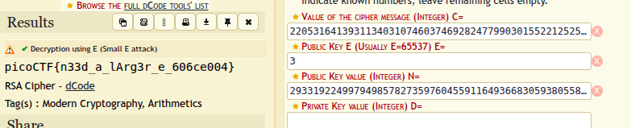

# RSA Oracle

> Can you abuse the oracle? An attacker was able to intercept communications between a bank and a fintech company. They managed to get the [message](https://artifacts.picoctf.net/c_titan/32/secret.enc) (ciphertext) and the [password](https://artifacts.picoctf.net/c_titan/32/password.enc) that was used to encrypt the message.

## Solution:

The challenge provides two encrypted files and hints at a Chosen Plaintext Attack vulnerability. The RSA encryption system can be exploited when we can interact with a decryption oracle.

The attack works as follows:
1. We have ciphertext `C = m^e mod n` that we want to decrypt
2. We choose a multiplier value `r` and compute `r^e mod n`
3. We submit `C' = C × r^e mod n` to the decryption oracle
4. The oracle returns `m' = (C')^d mod n = (m × r)^ed mod n = m × r mod n`
5. We then compute `m = m' ÷ r` to recover the original message

For this challenge, I used `r = 1` (ASCII value 49, hex 0x31) since the oracle only accepts character input.

First, I encrypted the value `1` through the oracle:

```
*****************************************
****************THE ORACLE***************
*****************************************
what should we do for you?
E --> encrypt D --> decrypt.
E
enter text to encrypt (encoded length must be less than keysize): 1
1

encoded cleartext as Hex m: 31

ciphertext (m ^ e mod n) 4374671741411819653095065203638363839705760144524191633605358134684143978321095859047126585649272872908765432040943055399247499744070371810470682366100689
```

Then I multiplied the password ciphertext by this value and submitted it for decryption:

```
what should we do for you?
E --> encrypt D --> decrypt.
D
Enter text to decrypt: 7721457704147667243014822210342015623441070646730334329369170960482434424280036173642970043315437595085392083961667520112650054794430310042790658505492250245959249047521482534760405619663668251566587006095670290533332380625235238831595584837302490911416483426164534051847266716546285422298258161162428036900
decrypted ciphertext as hex (c ^ d mod n): ac2c1742ee9
decrypted ciphertext:
ÂÁt.é
```

The returned hex value `ac2c1742ee9` represents `m × r`. To recover the original password, I divided by `0x31`:

```
0xac2c1742ee9 ÷ 0x31 = 0x3838316439
```

Converting this hex to ASCII gives `881d9`, which is the password needed to decrypt the secret message.

Using this password with openssl:

```
> openssl enc -aes-256-cbc -d -in secret.enc -k  881d9
*** WARNING : deprecated key derivation used.
Using -iter or -pbkdf2 would be better.
picoCTF{su((3ss_(r@ck1ng_r3@_881d93b6}
```

## Flag:

```
picoCTF{su((3ss_(r@ck1ng_r3@_881d93b6}
```

## Concepts learnt:

- Chosen Ciphertext Attack on RSA
- RSA multiplicative property exploitation
- Combining asymmetric and symmetric encryption

## Notes:

- The attack leverages the homomorphic property of RSA where `enc(m1 × m2) = enc(m1) × enc(m2)`
- Any multiplier value can be used as long as we can compute its encryption
- The oracle's restriction to character input limited the choice of multiplier

## Resources:

- [Chosen Plaintext Attack on RSA](https://crypto.stackexchange.com/questions/2323/how-does-a-chosen-plaintext-attack-on-rsa-work)

---

# Custom Encryption

> Decrypt the flag encrypted with a custom algorithm

## Solution:

The encryption uses a combination of Diffie-Hellman key exchange, XOR encryption, and multiplication. Let's analyze the encryption process:

1. **Key Generation**: Uses Diffie-Hellman with p=97, g=31, a=95, b=21
2. **XOR Encryption**: Uses key "trudeau" 
3. **Final Encryption**: Multiplies each character by shared_key × 311

First, I calculated the shared key:
```
u = g^a mod p = 31^95 mod 97 = 72
v = g^b mod p = 31^21 mod 97 = 8  
key = v^a mod p = 8^95 mod 97 = 85
b_key = u^b mod p = 72^21 mod 97 = 85
shared_key = 85
```

The encryption multiplier is `85 × 311 = 26435`. To decrypt, I reversed the process:

```python
cipher = [237915, 1850450, 1850450, 158610, 2458455, 2273410, 1744710, 1744710, 1797580, 1110270, 0, 2194105, 555135, 132175, 1797580, 0, 581570, 2273410, 26435, 1638970, 634440, 713745, 158610, 158610, 449395, 158610, 687310, 1348185, 845920, 1295315, 687310, 185045, 317220, 449395]

shared_key = 85
multiplier = 311
divisor = shared_key * multiplier

# Reverse the multiplication
xor_text = []
for value in cipher:
    char_code = value // divisor
    xor_text.append(chr(char_code))

semi_cipher = "".join(xor_text)

# Reverse the XOR encryption
plaintext = ""
key = "trudeau"
for i, char in enumerate(semi_cipher):
    key_char = key[i % len(key)]
    decrypted_char = chr(ord(char) ^ ord(key_char))
    plaintext += decrypted_char

# The original was reversed before XOR
flag = plaintext[::-1]
print(flag)
```

Running this script gives the flag.

## Flag:

```
picoCTF{custom_d2cr0pt6d_66778b34}
```

## Concepts learnt:

- Custom cryptographic algorithm analysis
- Diffie-Hellman key exchange
- XOR cipher cryptanalysis
- Reverse engineering encryption processes

## Notes:

- The algorithm reverses the plaintext before XOR encryption
- The shared key is constant given fixed a and b values
- Division works perfectly since the multiplication doesn't involve modular arithmetic

## Resources:

- Python documentation for cryptographic operations

---

# miniRSA

> Let's decrypt this: [ciphertext](https://jupiter.challenges.picoctf.org/static/ee7e2388b45f521b285334abb5a63771/ciphertext)? Something seems a bit small.

## Solution:

The challenge presents an RSA encryption with a very small public exponent (e=3). This makes it vulnerable to a cube root attack when the plaintext is small enough that `m^3 < n`.

Given:
- `N`: Very large modulus
- `e`: 3 (very small)
- `ciphertext`: The encrypted message

The encryption formula is:
```
c = m^3 mod n
```

If `m^3 < n`, then the modulo operation doesn't actually affect the result, and we can recover the plaintext by simply taking the cube root of the ciphertext:
```
m = c^(1/3)
```

I used an online RSA tool to perform this attack:



The tool successfully computed the cube root of the ciphertext and converted it to ASCII, revealing the flag.

## Flag:

```
picoCTF{n33d_a_lArg3r_e_606ce004}
```

## Concepts learnt:

- RSA with small public exponent vulnerability
- Cube root attack
- Importance of proper padding in RSA
- Textbook RSA weaknesses

## Notes:

- This attack works when `m^e < n`
- In practice, proper padding schemes like OAEP prevent this attack
- The flag itself suggests the solution - we need a larger exponent

## Resources:

- [RSA Cryptosystem](https://en.wikipedia.org/wiki/RSA_cryptosystem)
- [Cube Root Attack on RSA](https://crypto.stackexchange.com/questions/33561/cube-root-attack-rsa-with-low-exponent)
- [dCode RSA Cipher Tool](https://www.dcode.fr/rsa-cipher)
