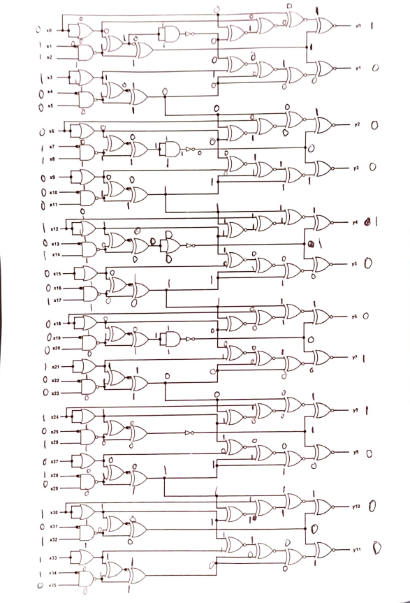
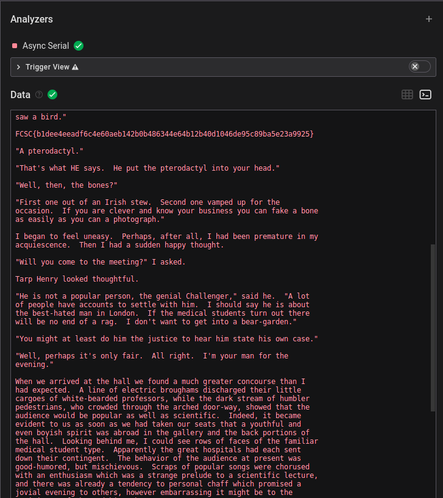
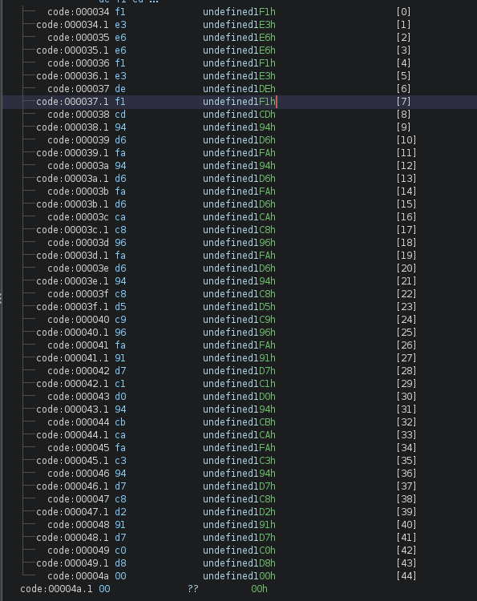

# IQ Test

> let your input x = 30478191278. wrap your answer with nite{ } for the flag.

## Solution:

The challenge provides a specific input value `30478191278` and requires converting it to binary format for processing through a logic system. The conversion yields a binary representation that needs to be properly formatted to match the expected input length.

Converting `30478191278` to binary:
```
11100011000101001000100101010101110
```

The binary result contains 35 bits, but the system expects 36 inputs. Therefore, a leading zero must be prepended to create the proper 36-bit input:
```
011100011000101001000100101010101110
```

Using Boolean algebra and logic analysis, the input is processed through the system to generate the corresponding output. The transformation follows the system's logic rules to produce the final result.



The output generated from the processed input is:
```
100010011000
```

## Flag:

```
nite{100010011000}
```

## Concepts learnt:

- Binary number conversion and representation
- Bit manipulation and padding
- Digital logic systems
- Boolean algebra applications
- Input-output transformation in logic circuits

## Notes:

- Proper bit length alignment is crucial for logic systems
- Leading zeros can be significant in binary representations
- Logic systems often require specific input formats
- The challenge demonstrates practical application of digital logic concepts

## Resources:

- Binary conversion tools and methods
- Digital logic design principles

---

# I Like Logic

> i like logic and i like files, apparently, they have something in common, what should my next step be.

## Solution:

The challenge provides a file called `challenge.sal`, which is a Saleae Logic Analyzer capture file. These files contain digital signal data captured from logic analyzers, commonly used for analyzing communication protocols and digital circuits.

Initial file analysis confirms the file type:
```
challenge.sal: Saleae Logic data, version 1.2, 1 channel, 100.0 MHz, 12345678 samples
```

Opening the file in Saleae Logic 2 software reveals the captured signal:


Analysis of the signal pattern suggests it represents UART (Universal Asynchronous Receiver/Transmitter) communication, characterized by its start bit, data bits, and stop bit structure. To decode UART signals, the baud rate must be determined.

The baud rate is calculated by measuring the duration of the shortest pulse (least significant bit). Measurement reveals the shortest pulse duration:


The measured pulse duration is 104.16 microseconds. Calculating the baud rate:
```
1 / 104.16μs × 1,000,000 = 9600.614439324
```

The nearest standard baud rate is 9600, which matches the calculated value closely.

Configuring the Saleae Logic analyzer with the identified parameters:
- Protocol: Async Serial
- Baud Rate: 9600
- Data Bits: 8
- Parity: None
- Stop Bits: 1


The decoded data reveals text content with the flag embedded within:



The decoded output contains literary text with the flag clearly visible:
```
... [text omitted for brevity] ...

FCSC{b1dee4eeadf6c4e60aeb142b0b486344e64b12b40d1046de95c89ba5e23a9925}

... [text omitted for brevity] ...
```

## Flag:

```
FCSC{b1dee4eeadf6c4e60aeb142b0b486344e64b12b40d1046de95c89ba5e23a9925}
```

## Concepts learnt:

- Saleae Logic Analyzer file format (.sal)
- UART communication protocol analysis
- Baud rate calculation and identification
- Digital signal decoding
- Logic analyzer tool usage
- Serial communication protocols

## Notes:

- UART signals require correct baud rate for proper decoding
- Standard baud rates include 9600, 19200, 38400, 115200, etc.
- Logic analyzer tools can automatically decode various protocols
- Signal timing analysis is crucial for baud rate determination
- Real captured data often contains meaningful information beyond test patterns

## Resources:

https://support.saleae.com/
https://kashmir54.github.io/ctfs/CyberApocalypse2021/

---

# Bare Metal Alchemist

> my friend recommended me this anime but i think i've heard a wrong name.

## Solution:

The challenge provides an ELF file `firmware.elf` targeting Atmel AVR 8-bit architecture, commonly used in embedded systems and microcontrollers.

Initial file analysis:
```
firmware.elf: ELF 32-bit LSB executable, Atmel AVR 8-bit, version 1 (SYSV), statically linked, with debug_info, not stripped
```

Initial string analysis reveals limited useful information, primarily consisting of hardware register names and compiler metadata. The file requires deeper analysis through disassembly and decompilation.

Using Ghidra for decompilation provides readable C code from the AVR assembly. The main function contains embedded system initialization code and the core logic:


Analysis of the decompiled code reveals a critical section where data is processed through XOR operations:

```c
R11 = 0xa5;
// ... code omitted for brevity ...
Z._0_1_ = (byte)R25R24 ^ R11;  // XOR operation with 0xA5
```

The code processes data starting at memory address `0x68` through XOR operations with the key `0xA5`. Examining the data at this address in Ghidra reveals the encrypted content:



The encrypted data at address `0x68` is:
```
F1, E3, E6, E6, F1, E3, DE, F1, CD, 94, D6, FA, 94, D6, FA, D6, 
CA, C8, 96, FA, D6, 94, C8, D5, C9, 96, FA, 91, D7, C1, D0, 94, 
CB, CA, FA, C3, 94, D7, C8, D2, 91, D7, C0, D8, 00
```

A Python script is created to decrypt this data by XORing each byte with `0xA5`:

```python
encrypted_data = [
    0xF1, 0xE3, 0xE6, 0xE6, 0xF1, 0xE3, 0xDE, 0xF1, 0xCD, 0x94, 
    0xD6, 0xFA, 0x94, 0xD6, 0xFA, 0xD6, 0xCA, 0xC8, 0x96, 0xFA, 
    0xD6, 0x94, 0xC8, 0xD5, 0xC9, 0x96, 0xFA, 0x91, 0xD7, 0xC1, 
    0xD0, 0x94, 0xCB, 0xCA, 0xFA, 0xC3, 0x94, 0xD7, 0xC8, 0xD2, 
    0x91, 0xD7, 0xC0, 0xD8, 0x00
]

key = 0xA5
decrypted = [byte ^ key for byte in encrypted_data]

flag = ''.join(chr(byte) for byte in decrypted if byte != 0)
print(flag)
```

The decryption reveals the flag embedded in the firmware.

## Flag:

```
TFCCTF{Th1s_1s_som3_s1mpl3_4rdu1no_f1rmw4re}
```

## Concepts learnt:

- Embedded firmware analysis
- AVR microcontroller architecture
- Ghidra decompilation for embedded systems
- XOR encryption and decryption
- Firmware reverse engineering
- Memory analysis in embedded contexts

## Notes:

- AVR ELF files require specific tooling for proper analysis
- Embedded firmware often contains hardcoded secrets
- XOR is a common simple encryption method in embedded systems
- Ghidra provides powerful decompilation capabilities for various architectures
- Understanding microcontroller memory mapping is crucial for firmware analysis

## Resources:

- Ghidra reverse engineering framework
- AVR architecture documentation
- Embedded systems development resources
