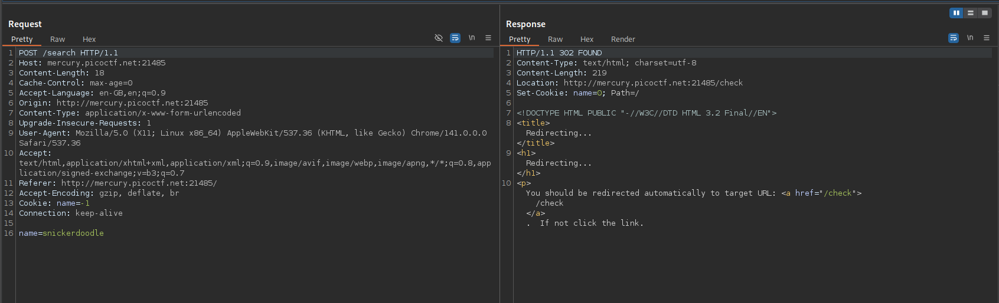

# Web Gauntlet

> Can you beat the filters? Log in as admin http://shape-facility.picoctf.net:61909/ http://shape-facility.picoctf.net:61909/filter.php

## Solution:

The challenge presents a series of SQL injection filters that progressively become more restrictive across five rounds. The goal is to bypass authentication as the admin user despite the evolving security measures.

Round 1

The initial filter blocks only the "or" keyword. The SQL query structure is:
`SELECT * FROM users WHERE username='' AND password=''`
Using the payload `admin'--` effectively comments out the password check, transforming the query to:
`SELECT * FROM users WHERE username='admin'--' AND password='hello'`

Round 2 
With additional filters blocking "or", "and", "like", "=", and "--", the previous comment method becomes ineffective. The alternative payload `admin'/*` uses block comments to achieve the same result:
`SELECT * FROM users WHERE username='admin'/*' AND password='hello'`

Round 3
The filters expand to include spaces and comparison operators, but the same `admin'/*` payload remains effective since the comment syntax bypasses the additional restrictions.

Round 4
The critical development is the filter now blocks the word "admin" directly. The solution involves string concatenation with `ad'||'min';` which constructs the username while avoiding the banned term:
`SELECT * FROM users WHERE username='ad'||'min';' AND password='hello'`
The semicolon terminates the SQL statement, preventing further validation.

Round 5
Additional filtering of "union" doesn't impact the existing payload, allowing `ad'||'min';` to continue working successfully.

After completing all five rounds, examining the filter.php source code reveals the flag in a comment, demonstrating successful mastery of the SQL injection evasion techniques.

## Flag:

```
picoCTF{y0u_m4d3_1t_79a0ddc6}
```

## Concepts learnt:

- SQL injection techniques and evasion methods
- Comment-based query manipulation
- String concatenation for filter bypass
- Progressive security filter analysis
- Authentication bypass methodologies

## Notes:

- Different SQL comment syntaxes serve similar purposes
- String concatenation effectively circumvents keyword filters
- Query termination with semicolons can prevent additional validation
- Each round required adapting to new filter constraints

## Resources:

https://youtu.be/2OPVViV-GQk?si=olH0Lgp9zBf5CYp
https://www.invicti.com/blog/web-security/sql-injection-cheat-sheet/

---

# SSTI1

> Server-side template injection challenge at http://rescued-float.picoctf.net:61245/

## Solution:

The challenge involves exploiting a Server-Side Template Injection vulnerability in what appears to be a Python Flask application using Jinja2 templating. The initial reconnaissance through Burp Suite revealed server headers indicating Python-based technology.

The testing began with basic template injection attempts. Inputting `{{ 7*7 }}` returned 49, confirming the presence of an active Jinja2 template engine vulnerable to injection attacks.


The exploitation strategy involved accessing Python's built-in functions through the template context to execute system commands. The constructed payload leveraged the request object's application globals to import the os module and execute shell commands:

```
{{request.application.__globals__.__builtins__.__import__('os').popen('ls').read()}}
```

This payload breakdown reveals the exploitation chain:
- `request.application` accesses the Flask application context
- `__globals__` retrieves the module's global variables
- `__builtins__` accesses Python's built-in functions
- `__import__('os')` imports the operating system module
- `popen('ls').read()` executes the directory listing command and reads output

The command execution revealed critical files including `flag`, `app.py`, and `requirements.txt`. To retrieve the flag, the payload was modified to read the flag file:

```
{{request.application.__globals__.__builtins__.__import__('os').popen('cat flag').read()}}
```


## Flag:

```
picoCTF{s4rv3r_s1d3_t3mp14t3_1nj3ct10n5_4r3_c001_bcf73b04}
```

## Concepts learnt:

- Server-Side Template Injection (SSTI) vulnerabilities
- Jinja2 template engine exploitation
- Python object attribute chaining for code execution
- Remote command execution through template injection
- Application context traversal in Flask framework

## Notes:

- Template injection testing should begin with simple arithmetic operations
- The request object provides extensive access to application internals
- Understanding Python's dunder methods is crucial for advanced exploitation
- Proper input validation could prevent such template injection attacks

## Resources:

https://onsecurity.io/article/server-side-template-injection-with-jinja2/

---

# Cookies

> Who doesn't love cookies? Try to figure out the best one. http://mercury.picoctf.net:21485/

## Solution:

The challenge presents a cookie validation system where the objective is to identify which cookie contains the flag. Initial analysis using Burp Suite revealed the application flow: users submit cookie names via POST to `/search`, followed by redirection to `/check` for validation.


The investigation began with testing common cookie names like "snickerdoodle" and "chocolate chip", which revealed that the application uses numeric identifiers in the `name` cookie parameter to track submissions. Each valid cookie name corresponds to an incremental numeric value.



The key insight was that the `name` parameter in subsequent requests contained numeric values that mapped to different cookie types. Using Burp Suite's Intruder module, a systematic attack was launched testing `name` values from 0 to 30 to identify which numeric identifier would reveal the flag.


The analysis of responses showed that `name=18` returned the flag content, indicating that the eighteenth cookie in the application's database contained the sought-after credential.


## Flag:

```
picoCTF{3v3ry1_l0v3s_c00k135_94190c8a}
```

## Concepts learnt:

- HTTP cookie manipulation and analysis
- Session management vulnerabilities
- Parameter fuzzing techniques
- Burp Suite Intruder functionality
- Sequential identifier exploitation

## Notes:

- Cookie values often map to server-side data structures
- Sequential numeric identifiers can be enumerated
- Automated fuzzing efficiently identifies valid values
- Response analysis is crucial for identifying success indicators

## Resources:

https://en.wikipedia.org/wiki/HTTP_cookie
